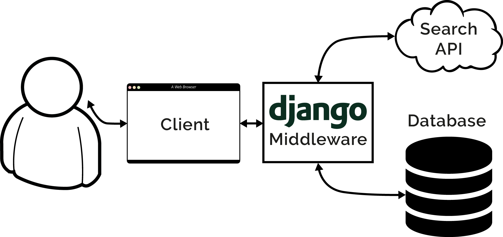
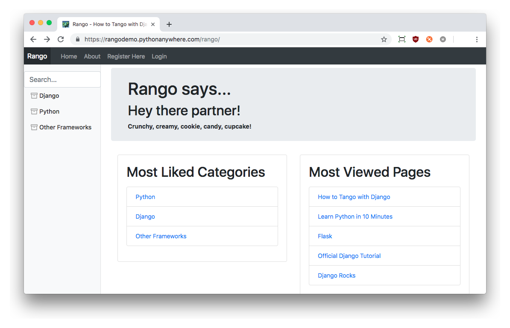
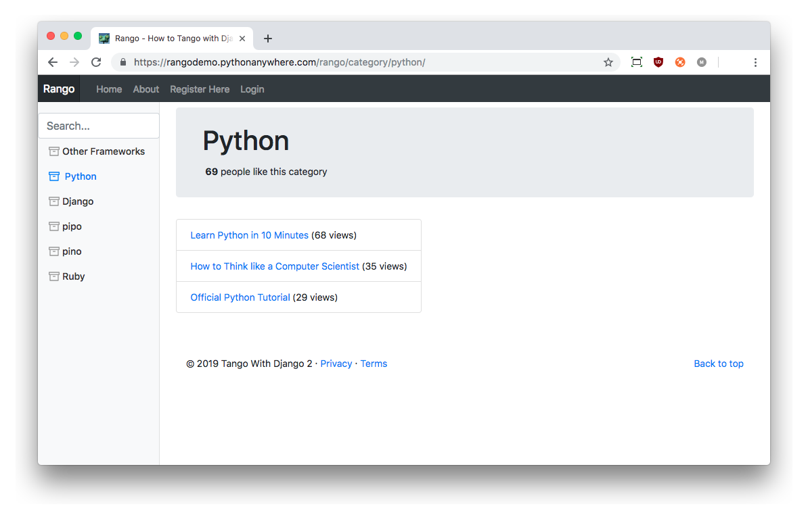

[11]: [official Django Tutorials](https://docs.djangoproject.com/en/2.0/intro/tutorial01/) 

[django2]: https://docs.djangoproject.com/en/2.0/ 
[tutorial01]: https://docs.djangoproject.com/en/2.0/intro/tutorial01/

# Введение
Цель этой книги - стать Вашим практическим руководством по веб разработке, используя *Django 2* и *Python 3*. Эта книга создана главным образом для студентов и представляет собой пошаговое руководство, необходимое для создания и запуска веб приложений с помощью Django.

Эта книга создана, чтобы дополнить [официальное руководство по Django]([tutorial01]) и многие другие прекрасные руководства доступные онлайн. Собрав всё необходимое в одном месте, эта книга заполняет многие пробелы в официальной документации по Django, что позволяет изучить фреймворк Django, используя метод обучения, основанный на примерах. Более того, эта книга является введением во многие особенности, необходимые, чтобы стать специалистом в области разработки веб приложений (например, HTML, CSS, JavaScript и т.д.).

## Почему стоит использовать эту книгу?
**Эта книга съэкономит Ваше время.** Часто мы видели как способные студенты не найдя решение какой-то проблемы, тратили часы, пытаясь бороться Django и другими особенностями веб разработки. Чаще всего проблема связана с тем, что им не известна какая-либо важная информация или что-то было не понятно. Хотя большинство таких проблем решаются за 10-15 минут, на некоторые из них может уйти до нескольких часов. Мы попытались избавиться от как можно большего числа таких проблем. Это означает, что Вы сможете сосредоточиться на разработке Вашего приложения и не тратить время на решение проблем возникающих при его создании.

**Эта книга уменьшит необходимый начальный порог вхождения, требуеммый для проектирования веб приложений.** Фреймворки для разработки веб приложений избавят Вас от многих трудностей и съэкономят Ваше время. Последнее предложение верно, если Вы знаете как их использовать! Часто процесс усвоения знаний происходит медленно. Эта книга должна Вам помочь в усвоении и ускорить этот процесс, объясняя как взаимодействуют друг с другом различные части фреймворка и как следует правильно создавать Ваше веб приложение.

**Эта книга улучшит Вашу последовательность операций над проектом.** При использовании фреймворков для создания веб приложений Вам нужно соблюдать  определенные шаблоны проектирования - т. е. Вы пишите только необходимые фрагементы кода в четко определенных местах. После работы со многими студентами, мы получили мого жалоб, касающихся использования фреймворков для создания веб приложений - особенно о том как они теряют над ними управление (так называемая [инверсия управления] (https://en.wikipedia.org/wiki/Inversion_of_control)). Чтобы помочь Вам, мы создали ряд *последовательностей действий*, позволяющих Вам сосредоточиться на процессе разработки, не терять это чувство контроля и проектировать Ваше веб приложение, придерживаясь определенного порядка.

**Эта книга не создана ТОЛЬКО для чтения.** Что бы Вы не делали, не надо *ТОЛЬКО читать эту книгу!* Это практическое руководство по созданию веб приложений в Django. Чтение никогда не заменит практический опыт. Чтобы получить больше опыта, пройдите через показанную в этой книге последовательность шагов и разработайте приложение. При программировании приложения, не просто *вырезайте и вставляйте код. Вводите его, думайте о том, что он деляет, затем читайте пояснения, которые мы дали, чтобы понять что происходит. Если Вы после этого все равно что-то не понимаете, обратитесь к документации по Django, задайте вопрос на [Stack Overflow](http://stackoverflow.com/questions/tagged/django) или на других полезных сайтах и заполните этот пробел в своих знаниях. Если проблему не удалось решить даже после этого, свяжитесь с нами, чтобы мы могли улучшить книгу - несколько наших [читателей](#chapter-acks) уже внесли свой вклад!

## Чему Вы научитесь
Эта книга использует метод обучения, основанный на примерах, для разработки веб приложений. В процессе обучения мы покажем Вам как спроектировать веб приложение, названное *Rango* ([смотри ТЗ ниже](#overview-design-brief-label)) и пошагово расскажем как растроить, разработать и развернуть приложение на сервере. По ходу повествования, мы покажем как решить следующие ключевые задачи часто встречающиеся при разработке программного обеспечения и веб проектов.

* Как **настроить Вашу локальную среду окружения** - включая то как использовать терминал, Ваше вирутальное окружение, `pip` инсталятор, как работать с Git и  т. д.
* Как **настроить Django проект** и создать базовое Django приложение.
* Как **сконфигурировать Django проект**, чтобы использовать статические медиа и другие медиа файлы.
* Как работать с шаблоном проектирования Django *Модель-Представление-Шаблон*.
* Как **работать с моделями баз данных** и использовать [*объектно-реляционное отображение (ORM)*](https://en.wikipedia.org/wiki/Object-relational_mapping), предоставляемое Django.
* Как **создавать формы**, которые могут использовать Ваши модели из базы данных для получения динамически генерируемых страниц.
* Как использовать службы **аутентификации пользователя**, предоставляемые Django.
* Как добавить **внешние службы** в Ваше приложение Django.
* Как добавить *Каскадные таблицы стилей (CSS)* и *JavaScript* в веб приложение.
* Как **использовать CSS**, чтобы улучшить внешний вид и впечатление о веб приложении.
* Как работать с **cookies и сессиями** в Django.
* Как добавить дополнительные функциональные возможности, например, *AJAX*, в Ваше приложение.
* Как **развернуть Ваше приложение** на веб сервере, используя *PythonAnywhere.*

Кроме того в эту часть **How To Tango with Django 2.0** были добавлены следующие разделы:

* Как **добавить логирование в веб приложение**
* Как **написать представление, используя класс** 
* Как **использовать внешнюю базу данных** 

В конце каждой главы мы добавили ряд упражнений, предназначенных мотивировать Вас применить знания, полученные во время изучения главы. Чтобы ещё сильнее Вас мотивировать, мы добавили множество задач, для решения которых Вам потребуются значения из многих предыдущих глав. Но не волнуйтесь для каждой задачи мы добавили решение и пояснение к ней!

> Упражнения будут обозначены вот так!

> В каждую главу мы добавили множество приложений, чтобы Вы могли проверить свои знания и навыки.

> *Вам нужно будет выполнить эти упражнения, поскольку последующие главы зависят от них.*

> Не волнуйтесь, если у Вас что-то не будет получаться, Вы всегда можете свериться с нашим решением всех упражнений из [*GitHub* репозитория](https://github.com/leifos/tango_with_django_2).

## Технологии и сервисы
В этой книге мы будем использовать различные технологии и внешние сервисы, включая:

* язык программирования [Python](http://www.python.org);
* [менеджер пакетов Pip](http://www.pip-installer.org);
* [Django](https://www.djangoproject.com);
* систему котроля версий [Git](http://git-scm.com);
* [GitHub](https://github.com);
* [HTML](http://www.w3.org/html/);
* [CSS](http://www.w3.org/Style/CSS/);
* язык программирования [JavaScript](https://www.javascript.com/);
* библиотеку [JQuery](http://jquery.com);
* фреймворк [Twitter Bootstrap](http://getbootstrap.com/);
* [Webhose API](https://webhose.io/) (также называемая *поисковым API*); и
* хостинг сервис [PythonAnywhere](https://www.pythonanywhere.com);

Мы выбрали эти технологии и сервесы, поскольку они либо являются фундаментальными для веб разработки и/или используются в качестве примера того как интегрировать Ваше веб приложение с CSS инструментариями (таким как *Twitter Bootstrap*), внешними сервисами (например, предоставляемыми *Webhose API*) и быстро и легко развернуть Ваше приложение, используя *PythonAnywhere*. Хорошо, давайте начнём!

## Rango: Первоначальное ТЗ и характеристики проекта {#overview-design-brief-label}
Основной задачей этой книги будет разработка приложения под названием *Rango*. При разработке этого приложения будут рассмотрены основные компоненты, которые должны быть спроектированы при создании любого веб-приложения. Полностью рабочую версию приложения можно найти на нашем сайте [How to Tango with Django](http://www.tangowithdjango.com/).

### Техническое задание

Представим, что мы хотим создать веб-сайт под названием *Rango*, который позволит пользователям просматривать категории, создаваемые пользователями, для доступа к различным веб-страницам. [В переводе с испанского слово rango](https://www.vocabulary.com/dictionary/es/rango) означает *"группа, упорядоченная по определенному свойству"* или *"место в социальной иерархии"* - поэтому можно сказать, что в некотором смысле мы хотим упорядочить веб-страницы в Rango.

* На **главной странице** сайта Rango, клиент хочет, чтобы пользователи могли видеть:
    * *5 самых просматриваемых страниц*;
    * *пять наиболее просматриваемых (или наивысших по рангу) категорий*; and
    * *способ, с помощью которого пользователи могли бы просматривать или осуществлять поиск* по категориям.
* Когда пользователь просматривает **страницу категории**,клиент хотел бы, чтобы на ней отображалось:
    * *название категории, количество посещений, число лайков*, а также список связанных с этой категорией страниц (отображается название страницы и ссылка на её URL); и
    * *инструменты, позволяющие осуществлять поиск (через поисковое API)*, чтобы найти другие страницы, которые можно связать с этой категорией.
* Для конкретной категории, клиент хотел бы хранить: *название категории*, *коилчетсво посещений каждой категории* и сколько пользователей *нажало на кнопку "like"* (т. е., сколько раз страница подняла свой ранг и поднялась по социальной иерархии).
* *Каждая категория должна быть доступна через читаемый URL* - например, `/rango/books-about-django/`.
* Только *зарегистрированные пользователи могут искать и добавлять страницы к категориям*. Также у посетителей сайта должна быть возможность зарегистрировать аккаунт.

На первый взгляд разрабатываемое приложение кажется довольно простым. По существу это просто список категорий, со ссылками на страницы. Тем не менее, существует множество сложностей и проблем, которые необходимо решить. Во-первых, давайте попытаемся получить более полную картину того, что нам необходимо разработать, сформулировав некоторые высокоуровневые концепции.

> ### Упражнения
> Перед тем как продолжить, подумайте о требованиях клиента и создайте следующие составляющие проекта. 

> * Как будет выглядеть высокоуровневая архитектура? Изобразите **N-уровневую или системную** схему, описывающую высокоуровневые системные составляющие.
> * Как будет выглядеть интервфейс? Изобразите **каркасы** главной страницы и страницы категории.
> * Какой вид должны иметь URLы, посещаемые пользователями? Запишите ряд **URL отображений** для приложения.
> * Какие данные мы должны сохранять или отображать? Создайте диаграмму [***сущность-связь***](https://en.wikipedia.org/wiki/Entity%E2%80%93relationship_model) для описания модели данных, которую мы будем реализовывать.
>
> Прежде чем продолжить чтение попытайтесь выполнить эти упражнения - даже если вы не знакомы со схемой системной архитектуры, каркасами или 
> диаграммной сущность-связь, как бы Вы формально объяснили и описали то, что Вам нужно спроектировать, так, чтобы он понял Вас.

{pagebreak}

### N-уровневая архитектура

Высокоуровневой архитектурой для большинства веб приложений считается *3-уровневая архитектура*. Rango будет разновидностью этой архитектуры, поскольку он также взаимодействует с внешним сервисом.

{id="fig-ntier"}

Для каждого элемента в этой высокоуровневой архитектуре мы должны выбрать технологию, которая будет использоваться для его реализации. Поскольку мы создаем веб приложение с помощью Django, мы будем использовать следующие технологии для следующих уровней.

* **Клиентом** будет веб браузер (например, *Chrome*, *Firefox* и *Safari*), который будет отображать HTML/CSS страницы.
* **ПО промежуточного слоя** будет приложение *Django*, и взаимодействие с ним будет происходить через встроенный в Django веб сервер для разработки во время разработки (и затем через веб-сервер, например, *nginx* или *apache web server*).
* **Базой данных** будет, основанный на Python, драйвер базы данных **SQLite3**.
* **Поисковым API** будет поисковое API.

В большей степени эта книга будет посвящена разработке ПО промежуточного слоя. хотя должно быть видно из [схемы системной архитектуры](#fig-ntier), что мы должны взаимодействовать со всеми компонентами.

### Каркасы
Каркасы позволяют клиентам понять как будет выглядеть приложение и какие возможности оно будет предоставлять. Они экономят кучу времени, и могут быть как от руки нарисованными эскизами, так и точными макетами, в зависимости от доступных Вам инструментов. Для нашего приложения Rango мы хотим, чтобы главная страница сайта выглядела как [снимок экрана, показанный ниже](#fig-index-page). Наша страница категорий также [показана ниже](#fig-cat-page).

{id="fig-index-page"}

{id="fig-cat-page"}

### Страницы и URL отображения
Из ТЗ мы уже определили две страницы, которые наше приложение будет выдавать пользователю в разные моменты времени. Чтобы получить доступ к каждой из этих страниц нам необходимо описать URL отображения. Думайте об URL отображении как о тексте, который должен ввести в адресной строке браузера пользователь, чтобы перейти на заданную страницу. Основные URL отображения для Rango показаны ниже.

* ``/`` или ``/rango/`` будет выводить главную / индексную страницу.
* ``/rango/about/`` будет выводить страницу about.
* ``/rango/category/<category_name>/`` будет выводить страницу категории ``<category_name>``, где категорией могут быть:
    * игры;
    * рецепты python; или
    * код и компиляторы.

При создании нашего приложения нам вероятно понадобится создавать другие URL отображения. Тем не менее мы начнем с перечисленных выше, что даст нам представление о том как должны выглядеть URL для других страниц. Также по ходу чтения книги, мы выясним как создавать эти страницы, используя фреймворк Django, и использовать его шаблон проектирования [Модель-Представление-Шаблон]([django2]). Однако сейчас, имея представление о URL отображении и о том как будут выглядеть страницы, нам нужно определить модель данных, которая будет содержать данные нашего веб приложения.

### Entity-Relationship Diagram {#overview-er}
Учитывая ТЗ должно быть понятно, что мы имеем по крайней мере две сущности: *категория* и *страница*. Должно быть также ясно, что *категория* может содержать много *страниц*. Мы можем создать следующую диаграмму сущность-связь, чтобы описать эту простую модель данных. 

{id="fig-rango-erd"}

Обратите внимание, что это ТЗ является нечетким. Одна страница в теории может находится в одной или нескольких категориях. С учётом этого, мы можем моделировать связь между категориями и страницами как [связь много-ко-многим](https://en.wikipedia.org/wiki/Many-to-many_(data_model)). Этот подход, однако, приводит к ряду сложностей, поэтому мы сделаем упрощающее предположение, что *одна категория содержит много страниц, но одна страница связана только с одной категорией.* Это не исключает варианта, когда одна и та же страница может быть связана с различными категориями - но страница должна быть введена дважды. Хотя это не идеальный вариант, но это уменьшит сложность моделей.

> ### Обратите внимание!
> Возьмите в привычку записывать любые упрощения, сделанные в проекте, как например, предположение о связи один-ко-многим, сделанное выше. Вы 
> никогда не знаете, когда это выйдет боком! Записывая их, Вы таким образом сообщаете о них своей команде разработчиков и можете убедиться, что это 
> предположение целесообразно и они не против работать с этим предположением.

Учитывая это предположение, мы можем создать ряд таблиц, которые описывают каждую сущность более подробно. Таблицы содержат информацию о том какие поля содержатся в каждой сущности. Мы используем тип Django `ModelField` для определения типа каждого поля (например, `IntegerField`, `CharField`, `URLField` или `ForeignKey`). Обратите внимание, что в Django *первичные ключи* определяются неявно, поскольку Django добавляет поле `id` к каждой модели, но мы поговорим подробнее об этом позднее в главе Модели и База Данных.

#### Модель Категория

| Поле    | Тип             |
|---------|-----------------|
| `name`  | `CharField`     | 
| `views` | `IntegerField`  |
| `likes` | `IntegerField`  |

#### Модель Страница

| Поле       | Тип            |
|------------|----------------|
| `category` | `ForeignKey`   | 
| `title`    | `CharField`    |
| `url`      | `URLField`     |
| `views`    | `IntegerField` |

У нас также будет модель для `Пользователя`, чтобы они могли регистрироваться и входить в систему. Мы не показываем её здесь, а введём её позднее в книге, когда будем обсуждать аутентификацию пользователя. В следующих главах, мы увидим как создавать экземпляры этих моделей в Django и как объектно-реляционное отображение для связи с базой данных.

## Резюме
При проектировании нашего веб приложения мы будем ссылаться на это высокоуровневое проектирование и ТЗ. Хотя мы будем концентрироваться на использовании специальных технологий, эти шаги являются общими для большинства веб сайтов, использующих базы данных. Хорошо, когда Вы знаете как работать и создавать такие ТЗ и схемы, потому что в этом случае рассказать о своём проекте и идеях с другими. В этой книге мы будем использовать Django и связанные с ней технологии для реализации этого ТЗ.

> ### Вырезание и вставка кода
>
> По мере чтения учебного пособия, Вы скорее всего захотите вырезать и вставить код из книги в Ваш редактор кода.
> **Но лучше вводить код вручную.** Мы понимаем, что вводить код вручную дольше, но это поможет Вам лучше запомнить пройденный материал и прочувствовать команды, которые Вы будете часто использовать.
>
> Более того, вырезание и вставка кода на языке Python может приводить к проблемам. Отстут может быть интерпретирован как несколько пробелов, табуляций или смеси пробелов и табуляций. Это приведет к различным странным ошибкам, которые не всегда будут ошибками отступа. Если вы вырезаете и вставляете код - будьте готовы к появлению таких ошибок. Обратите особое внимание на это, если вы используете Python 3 - непоследовательное использование  табуляций и пробелов в Вашем коде приведет к `TabError`.
> 
> Большинство редакторов кода показывают являются ли отступы табуляциями или пробелами. Если Ваш редактор поддерживает эту возможность - включите её - это позволит Вам съэкономить время и нервы. 

